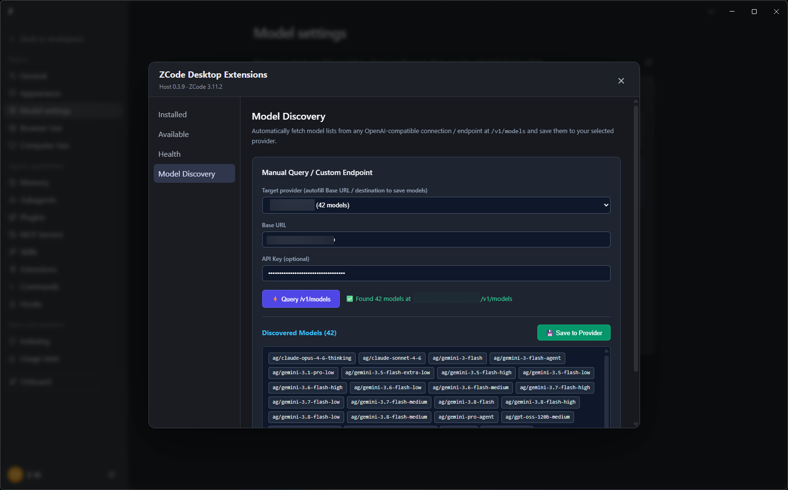

# ZCode Model Discovery



A desktop extension for [ZCode Desktop Extensions (ZDP)](https://github.com/notmike101/zcode-extensions) that automatically discovers model lists from any OpenAI-compatible `/v1/models` endpoint and saves them directly into ZCode provider configuration.

---

## ⚠️ Prerequisite: Install ZDP First

This extension requires the **ZCode Desktop Extensions (ZDP)** host runtime to be installed on your system before it can be loaded. If you have not yet installed ZDP, follow these steps first:

1. **Close ZCode completely.**
2. **Download ZDP:**
   Download the latest release archive (`zcode-extensions-vX.Y.Z-windows-x64.zip`) from the [notmike101/zcode-extensions Releases](https://github.com/notmike101/zcode-extensions/releases/latest).
3. **Extract to a permanent directory:**
   ```powershell
   Expand-Archive .\zcode-extensions-v0.3.9-windows-x64.zip -DestinationPath D:\
   Set-Location D:\zcode-extensions
   ```
4. **Install the extension loader:**
   ```powershell
   .\bin\zdp.exe install
   .\bin\zdp.exe launch
   ```
5. **Verify installation:**
   Once ZCode starts, verify that an **Extensions** item appears in ZCode's left navigation sidebar, directly below **Skills**.

---

## Features

- **Manual Query / Custom Endpoint**:
  - Connect to any OpenAI-compatible provider Base URL (e.g. `https://api.openai.com/v1`, local Ollama, vLLM, LiteLLM, 9router, etc.).
  - Normalizes endpoint paths automatically (handles trailing `/v1`, trailing slashes, or bare base hosts).
  - Optional API Key support with Bearer authentication.
  - Transparent error diagnostics: surfaces HTTP 401, 404, connection timeouts, or malformed responses.
  - Previews discovered model IDs.
  - One-click persistence: merges discovered models into the selected provider in `~/.zcode/v2/config.json` and updates the runtime state.
- **Isolated UI**:
  - Operates safely within its dedicated page under **Extensions → Model Discovery**.
  - Does not mutate or overload the native ZCode Settings DOM.

---

## Quick Installation (Prebuilt)

1. Clone or download this repository:
   ```bash
   git clone https://github.com/lurepos/zcode-model-discovery.git
   ```
2. Open ZCode and go to **Extensions → Installed**.
3. Click **Install folder** and select the cloned `zcode-model-discovery` folder.
4. The extension will activate immediately and show up as **Model Discovery** in the extension navigation list.

---

## How to Use

1. Click **Extensions → Model Discovery** in the sidebar.
2. In the **Manual Query / Custom Endpoint** section:
   - Select a target provider from the dropdown to automatically populate its Base URL and API Key, or enter them manually.
   - Click **⚡ Query /v1/models**.
   - If the endpoint succeeds, the discovered models will be listed as tags.
   - Click **💾 Save to Provider** to persist the models.

---

## Building From Source

If you make modifications to the TypeScript sources:

```bash
cd zcode-model-discovery
bun install
bun run build
```

Then in ZCode under **Extensions → Installed**, click **Reload** on the Model Discovery extension card.

---

## License

[MIT](LICENSE)
